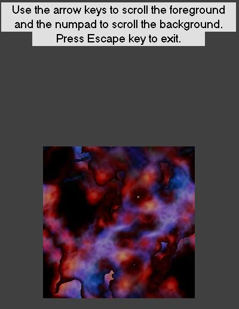



## Scrolling background \+ foreground

### Description

Demonstrates independantly scrolling foreground and background using seamless tiles. Screenshot does not do it justice since the point is to show how to scroll two separate background images at the same time.
 
### More Info
 

             |
---                |---
**Submitted On**   |2006-01-02 17:05:56
**By**             |[Brian Matthew Anderson](https://github.com/Planet-Source-Code/PSCIndex/blob/master/ByAuthor/brian-matthew-anderson.md)
**Level**          |Intermediate
**User Rating**    |4.7 (14 globes from 3 users)
**Compatibility**  |VB 5\.0, VB 6\.0
**Category**       |[Graphics](https://github.com/Planet-Source-Code/PSCIndex/blob/master/ByCategory/graphics__1-46.md)
**World**          |[Visual Basic](https://github.com/Planet-Source-Code/PSCIndex/blob/master/ByWorld/visual-basic.md)
**Archive File**   |[Scrolling\_196185122006\.zip](https://github.com/Planet-Source-Code/brian-matthew-anderson-scrolling-background-foreground__1-63904/archive/master.zip)

### API Declarations

Bitblt, GetTickCount

